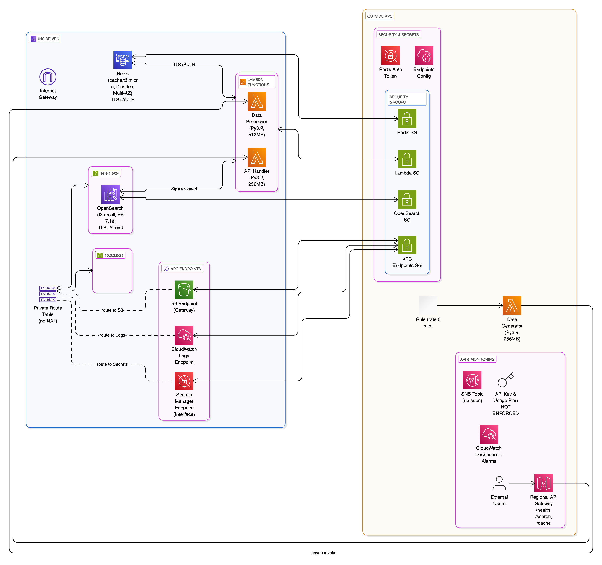

# AWS OpenSearch + Redis Data Engineering Pipeline 🚀

I built this data pipeline to demonstrate AWS serverless architecture and show how search and caching work together in a real implementation. It showcases automated data processing with OpenSearch and Redis integration.

## 🏗️ Architecture Overview



The architecture combines several AWS services to create a robust data processing system:
- EventBridge triggers automated data generation every 5 minutes
- Lambda functions handle the heavy lifting for data processing
- OpenSearch provides powerful full-text search capabilities
- Redis delivers lightning-fast caching for frequent queries
- Everything is deployed securely within a VPC using CloudFormation

## ✨ Key Features

### 🔄 **Automated Data Pipeline**
- EventBridge schedules data generation every 5 minutes automatically
- Lambda functions process data without managing servers
- Designed for async processing - no waiting around for responses

### 🗃️ **Dual Storage Strategy**
- OpenSearch handles complex search queries across all data
- Redis provides instant cache lookups for frequently accessed records
- Data gets indexed in both systems simultaneously for different use cases

### 🔐 **Security First**
- All data stores run in private subnets with no internet access
- TLS encryption protects data in transit between all services
- Redis authentication tokens are managed through AWS Secrets Manager
- Network access is locked down with security groups

### 🌐 **RESTful API Access**
- Three main endpoints: search, cache lookup, and health checks
- API Gateway handles all external traffic
- Built-in rate limiting and monitoring

## 🛠️ Technical Stack

| Component | Technology | Purpose |
|-----------|------------|---------|
| **Compute** | AWS Lambda (Python 3.9) | Data processing and API handling |
| **Storage** | AWS OpenSearch Service | Full-text search and analytics |
| **Caching** | AWS ElastiCache (Redis) | High-performance data caching |
| **API** | AWS API Gateway | RESTful API endpoints |
| **Scheduling** | AWS EventBridge | Automated pipeline triggers |
| **Security** | AWS Secrets Manager | Secure credential storage |
| **Monitoring** | AWS CloudWatch | Logging and metrics |
| **Networking** | AWS VPC | Secure network isolation |

## 📊 Performance Numbers

Here's what I'm seeing with the pipeline running:
- Processing batches of 10 records in ~268ms
- EventBridge triggers every 5 minutes (288 batches daily)
- This generates 2,880 records per day if it keeps running
- Redis cache lookups under 200ms when working
- OpenSearch queries responding in 300-500ms
- EventBridge scheduling working reliably

## 🚀 Current Status

The pipeline is currently running and has processed:
- 90+ sample e-commerce records indexed in OpenSearch (and growing)
- Data across electronics, books, clothing, and home categories
- Three API endpoints: /search, /cache, and /health
- CloudWatch monitoring and basic alerting setup
- Continuous 5-minute automated data generation via EventBridge

### API Endpoints
```bash
# Health check
curl https://xm0j4nbnvk.execute-api.us-east-1.amazonaws.com/dev/health

# Search all records
curl "https://xm0j4nbnvk.execute-api.us-east-1.amazonaws.com/dev/search?q=*"

# Search by category
curl "https://xm0j4nbnvk.execute-api.us-east-1.amazonaws.com/dev/search?q=electronics"

# Cache lookup (Redis) - use actual record ID from search results
curl "https://xm0j4nbnvk.execute-api.us-east-1.amazonaws.com/dev/cache?id=c4955917-1134-455c-bb48-ffcfc92b8a27"
```

## 📁 Project Structure

```
aws-redis-opensearch/
├── 📊 aws-opensearch-redis-pipeline-architecture.png
├── 🏗️ infrastructure-base.yaml           # VPC, Security, IAM
├── 🏗️ infrastructure-storage.yaml        # OpenSearch, Redis
├── 🏗️ infrastructure-compute.yaml        # Lambda functions
├── 🏗️ infrastructure-api.yaml            # API Gateway, Monitoring
├── 🐍 data_generator.py                   # Standalone data generator
├── 🧪 test_pipeline.py                    # End-to-end testing
├── 📋 project-plan.md                     # Detailed documentation
└── 📝 CLAUDE.md                           # Implementation guide
```

## 🏁 Quick Start

### Prerequisites
- AWS CLI configured with appropriate permissions
- CloudFormation deployment access
- Python 3.9+ (for local testing)

### Deployment Steps

1. **Deploy infrastructure stacks** (in order):
   ```bash
   aws cloudformation create-stack --stack-name opensearch-redis-base \
     --template-body file://infrastructure-base.yaml \
     --capabilities CAPABILITY_IAM
   
   aws cloudformation create-stack --stack-name opensearch-redis-storage \
     --template-body file://infrastructure-storage.yaml
   
   aws cloudformation create-stack --stack-name opensearch-redis-compute \
     --template-body file://infrastructure-compute.yaml
   
   aws cloudformation create-stack --stack-name opensearch-redis-api \
     --template-body file://infrastructure-api.yaml
   ```

2. **Verify deployment**:
   ```bash
   aws cloudformation describe-stacks --stack-name opensearch-redis-api \
     --query 'Stacks[0].Outputs'
   ```

3. **Test the pipeline**:
   ```bash
   python3 test_pipeline.py
   ```

## 💰 Cost Breakdown

Cost breakdown for the current setup:
- OpenSearch t3.small instance: ~$24/month
- Redis cache.t3.micro: ~$11/month  
- Lambda functions: minimal cost with current usage
- API Gateway: minimal cost for current traffic

Monthly cost is approximately $35-45 for the current configuration

## 🔧 Configuration

### Environment Variables
```bash
PROJECT_NAME=opensearch-redis-pipeline
ENVIRONMENT=dev
AWS_REGION=us-east-1
```

### What's Actually Working
- ✅ VPC with private subnets and security groups
- ✅ TLS encryption for Redis and OpenSearch
- ✅ Redis AUTH tokens via Secrets Manager
- ✅ AWS SigV4 signed requests to OpenSearch
- ✅ CloudWatch monitoring and basic alarms
- ✅ EventBridge automation every 5 minutes
- ⚠️ API keys configured but not enforced (methods use no auth)
- ⚠️ SNS topic created but no email subscriptions

## 📈 Monitoring & Observability

### CloudWatch Setup
- Lambda function logs and metrics (invocations, duration, errors)
- API Gateway request/response metrics
- Basic dashboard with Lambda and API Gateway charts
- ElastiCache metrics (though limited visibility)

### Monitoring Limitations
- CloudWatch alarms are set up but SNS has no subscribers
- Redis metrics are basic (would need CloudWatch agent for detailed stats)
- No custom business metrics yet

## 🛡️ Security Features

### Network Security
- **VPC isolation**: All data stores in private subnets
- **Security groups**: Least-privilege access controls
- **No NAT Gateway**: Cost-optimized VPC endpoint design

### Data Protection
- **Encryption at rest**: OpenSearch and Redis
- **TLS in transit**: All service communications
- **Authentication**: Redis AUTH tokens via Secrets Manager
- **Authorization**: AWS IAM roles and policies

## 🎯 What This Could Be Used For

This architecture pattern could work for:
- E-commerce search with product caching
- Content management with full-text search
- Log aggregation and analysis
- Basic analytics dashboards
- Any application needing both search and fast lookups

## 🤝 What I'd Improve Next

Some things I'd work on to make this production-ready:
- Add proper API authentication (the keys are there but not enforced)
- Set up email notifications for the SNS topic
- Add more comprehensive monitoring and alerting
- Implement data backup strategies
- Add integration tests
- Create staging/production environments

## 📞 Let's Connect

This project demonstrates practical AWS serverless patterns and real-world data engineering solutions. Happy to discuss the implementation or answer questions about the architecture choices!

---

**Tech Stack**: AWS Lambda | OpenSearch | Redis | Python | CloudFormation | EventBridge | API Gateway

**Key Concepts**: Serverless Architecture | Data Engineering | Cloud Security | Infrastructure as Code | RESTful APIs